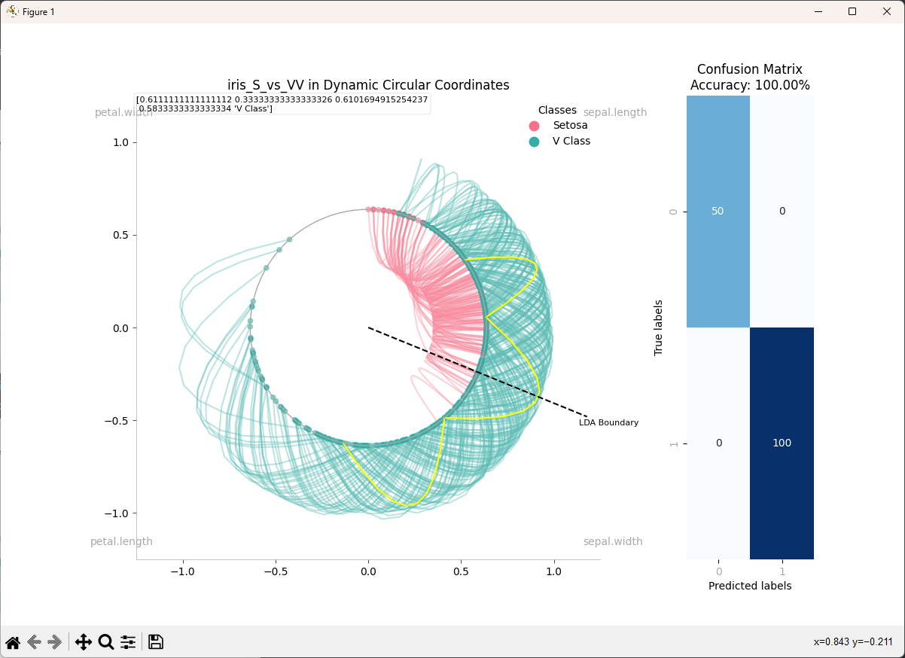

# CircularPlotter

**CircularPlotter** is a Python-based visualization tool designed to plot datasets in a circular format with Bezier curves connecting data points. This visualization is especially suited for datasets with a 'class' column and other numeric columns.

Wisconsin Breast Cancer dataset in dynamic circular coordinates with path highlighting:

## Features

    - Plots data points in a circular format based on the number of attributes.
    - Connects data points with Bezier curves, providing a clear and aesthetic representation.
    - Supports multiple classes with unique colors for each class.
    - Adjustable Bezier curve control points for inner and outer curves.
    - Integrated file-picker for easy dataset selection.

## Requirements

    - Python 3.x
    - Libraries:
        - numpy
        - pandas
        - matplotlib
        - sklearn
        - seaborn
        - tkinter

## License

This project is licensed under the [GNU General Public License v3.0](https://www.gnu.org/licenses/gpl-3.0.en.html).
